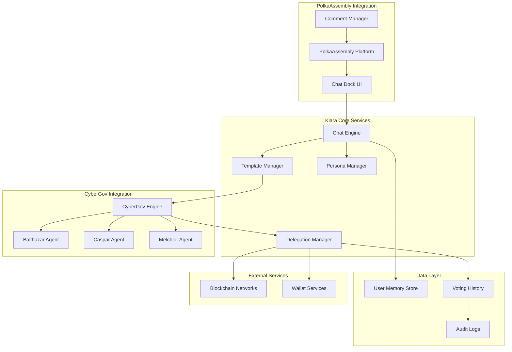

# Klara Delegate Design Document

## Overview

Klara Delegate is a conversational AI voting co-pilot that layers on top of the existing CyberGov infrastructure to provide user-friendly governance participation. The system implements a three-layer architecture where each layer has distinct responsibilities in the voting decision and execution process.

The design leverages the proven CyberGov three-agent system (Balthazar, Caspar, Melchior) as the core decision engine while adding user-configurable templates and personas to customize behavior and presentation.

## Architecture

### Three-Layer Architecture

The system implements a clear separation of concerns across three distinct layers:

**Layer 1: CyberGov Decision Engine**
- Utilizes existing Balthazar, Caspar, and Melchior agents
- Makes core voting decisions (Aye/Nay/Abstain) based on proposal analysis
- Maintains the proven truth table logic for decision consolidation
- Receives contextual information from Layer 2 but remains autonomous

**Layer 2: Template Processing Layer**
- Applies user-selected templates (Aggressive, Conservative, Growth-Oriented, etc.)
- Adjusts agent emphasis and context based on template configuration
- Processes template parameters and user customizations
- Provides structured input to Layer 1 agents without overriding their decisions

**Layer 3: Persona Presentation Layer**
- Handles user-defined commenting style and tone preferences
- Generates public rationale and explanations for PolkaAssembly
- Manages conversational interface and user interactions
- Customizes how decisions are communicated and presented

### System Components


## Components and Interfaces

### Chat Engine
**Responsibilities:**
- Natural language processing and conversation management
- Intent recognition and response generation
- Session state management and context preservation
- Integration with PolkaAssembly chat dock UI

**Key Interfaces:**
- `processMessage(userId, message, context)` - Handle user input
- `generateResponse(intent, context, userState)` - Create conversational responses
- `maintainSession(userId, sessionData)` - Manage conversation state

### Template Manager
**Responsibilities:**
- Manage pre-built persona templates (Aggressive, Conservative, etc.)
- Apply template configurations to CyberGov agent context
- Handle template customization and parameter validation
- Generate agent-specific context based on template selection

**Key Interfaces:**
- `getAvailableTemplates()` - Return list of available templates
- `applyTemplate(templateId, customizations)` - Configure template with user modifications
- `generateAgentContext(template, proposalData)` - Create context for CyberGov agents

### Persona Manager
**Responsibilities:**
- Handle user-defined commenting styles and presentation preferences
- Generate public rationale and explanations
- Customize tone and format of PolkaAssembly comments
- Manage persona-specific language and phrasing

**Key Interfaces:**
- `configurePersona(userId, preferences)` - Set user presentation preferences
- `generateRationale(decision, evidence, persona)` - Create public explanation
- `formatComment(rationale, style)` - Apply persona styling to comments

### Delegation Manager
**Responsibilities:**
- Handle on-chain delegation transactions
- Manage voting power transfers and revocations
- Execute votes through CyberGov infrastructure
- Monitor delegation status and blockchain events

**Key Interfaces:**
- `delegateVotingPower(userWallet, klaraAccount)` - Create delegation transaction
- `executeVote(proposalId, decision, rationale)` - Cast vote on-chain
- `revokeDelegation(userWallet)` - Remove delegation
- `monitorProposals(network)` - Watch for new referenda

## Data Models

### User Configuration
```typescript
interface UserConfig {
  userId: string;
  walletAddress: string;
  selectedTemplate: TemplateId;
  templateCustomizations: TemplateParameters;
  personaPreferences: PersonaConfig;
  delegationStatus: DelegationStatus;
  notificationSettings: NotificationConfig;
  networks: NetworkConfig[];
}
```

### Template Definition
```typescript
interface Template {
  id: TemplateId;
  name: string;
  description: string;
  agentWeights: {
    balthazar: number;
    caspar: number;
    melchior: number;
  };
  parameters: TemplateParameter[];
  defaultBehavior: BehaviorConfig;
}
```

### Voting Decision
```typescript
interface VotingDecision {
  proposalId: string;
  network: string;
  userId: string;
  template: TemplateId;
  agentVotes: {
    balthazar: Vote;
    caspar: Vote;
    melchior: Vote;
  };
  finalDecision: Vote;
  rationale: string;
  timestamp: Date;
  transactionHash?: string;
}
```## Inte
gration Architecture

### PolkaAssembly Integration
**Chat Dock Embedding:**
- Embedded iframe or web component within PolkaAssembly interface
- Maintains visual consistency with PolkaAssembly design system
- Handles authentication through PolkaAssembly's existing wallet integration
- Supports responsive design for mobile and desktop interfaces

**API Integration:**
- `GET /api/referenda/{id}` - Fetch proposal metadata from PolkaAssembly
- `POST /api/comments` - Post voting rationale as comments
- `GET /api/user/profile` - Access user authentication and profile data
- WebSocket connection for real-time proposal updates

### CyberGov Integration
**Agent Context Enhancement:**
The system enhances existing CyberGov agents with template-specific context without modifying core logic:

```typescript
interface AgentContext {
  sharedFacts: ProposalMetadata;
  focusBullets: string[];      // Template-specific emphasis points
  templateBias: string;        // Single line template context
  blockers?: string[];         // Hard block conditions from template
}
```

**Decision Flow Integration:**
1. Template Manager processes user configuration and proposal data
2. Generates agent-specific context based on template weights
3. Calls existing CyberGov agents with enhanced context
4. Accepts CyberGov truth table outcome without modification
5. Persona Manager formats decision for public presentation

### Blockchain Integration
**Multi-Network Support:**
- Polkadot: Primary network with full feature support
- Kusama: Canary network with experimental features
- Paseo: Testnet for development and testing
- Extensible architecture for additional Substrate-based networks

**Transaction Management:**
- Delegation transactions through proxy accounts
- Vote execution via CyberGov's existing infrastructure
- Transaction monitoring and confirmation tracking
- Gas fee estimation and optimization

## Error Handling

### Graceful Degradation Strategy
**Service Availability Tiers:**
1. **Full Service**: All components operational, complete functionality
2. **Read-Only Mode**: Chat and history access, no voting or delegation changes
3. **Offline Mode**: Cached responses and queued operations
4. **Emergency Mode**: Basic error messages and service status

**Error Recovery Patterns:**
- Circuit breaker pattern for external service calls
- Exponential backoff for blockchain transaction retries
- Fallback responses for AI service unavailability
- Queue-based processing for delayed operations

### User Communication
**Error Message Categories:**
- **Blockchain Errors**: Clear explanation with suggested actions
- **Wallet Errors**: Step-by-step troubleshooting guidance
- **Service Errors**: Status updates and estimated resolution times
- **Configuration Errors**: Validation feedback and correction suggestions

## Testing Strategy

### Unit Testing
**Component-Level Tests:**
- Template Manager: Template application and parameter validation
- Persona Manager: Comment generation and style application
- Chat Engine: Intent recognition and response generation
- Delegation Manager: Transaction creation and status tracking

### Integration Testing
**Cross-Component Tests:**
- End-to-end voting flow from chat to on-chain execution
- PolkaAssembly integration and comment posting
- CyberGov agent context enhancement and decision processing
- Multi-network delegation and voting scenarios

### User Acceptance Testing
**Scenario-Based Tests:**
- New user onboarding and template selection
- Template customization and parameter adjustment
- Voting decision explanation and rationale generation
- Error handling and recovery user experience

**Performance Testing:**
- Chat response time under load
- Concurrent user session management
- Blockchain transaction throughput
- Database query optimization## Se
curity Architecture

### Data Protection
**Encryption Strategy:**
- User data encrypted with wallet-derived keys using ECDSA signatures
- Template configurations stored with AES-256 encryption
- Chat history encrypted at rest with per-user keys
- Audit logs protected with cryptographic integrity checks

**Access Control:**
- Wallet-based authentication for all user operations
- Role-based access for administrative functions
- API rate limiting per user and endpoint
- Session management with secure token rotation

### Blockchain Security
**Transaction Safety:**
- Multi-signature requirements for high-value operations
- Transaction simulation before execution
- Gas limit validation and optimization
- Replay attack prevention through nonce management

**Delegation Security:**
- Cryptographic proof of delegation authorization
- Time-bounded delegation with automatic expiry options
- Revocation mechanisms with immediate effect
- Audit trail for all delegation changes

## Performance Considerations

### Scalability Design
**Horizontal Scaling:**
- Microservices architecture with independent scaling
- Load balancing across chat engine instances
- Database sharding by user ID and network
- CDN integration for static assets and templates

**Caching Strategy:**
- Template definitions cached in memory
- User configurations cached with TTL
- Proposal metadata cached from PolkaAssembly
- Voting history cached for quick retrieval

### Response Time Optimization
**Chat Performance:**
- Sub-3-second response time requirement
- Async processing for non-critical operations
- Predictive loading of common responses
- Connection pooling for database operations

**Blockchain Performance:**
- Batch processing for multiple votes
- Optimized RPC calls to blockchain nodes
- Transaction queue management
- Network-specific optimization strategies

## Monitoring and Observability

### Metrics Collection
**System Metrics:**
- Chat response times and error rates
- Voting execution success rates
- Template usage patterns and effectiveness
- User engagement and retention metrics

**Business Metrics:**
- Total votes cast per template type
- User satisfaction with voting decisions
- Template customization frequency
- Cross-network usage patterns

### Alerting Strategy
**Critical Alerts:**
- Blockchain connectivity failures
- CyberGov agent evaluation failures
- High error rates in chat responses
- Security incidents and unauthorized access

**Operational Alerts:**
- Performance degradation warnings
- Capacity threshold notifications
- Template effectiveness anomalies
- User experience quality indicators

## Deployment Architecture

### Environment Strategy
**Development Environment:**
- Local development with mocked blockchain
- Isolated template testing environment
- CyberGov integration sandbox
- Automated testing pipeline

**Staging Environment:**
- Testnet blockchain integration (Paseo)
- Full PolkaAssembly integration testing
- Performance and load testing
- Security penetration testing

**Production Environment:**
- Multi-region deployment for availability
- Blue-green deployment for zero downtime
- Automated rollback capabilities
- Real-time monitoring and alerting

### Infrastructure Requirements
**Compute Resources:**
- Chat engine: Auto-scaling container instances
- Database: High-availability PostgreSQL cluster
- Cache: Redis cluster for session management
- CDN: Global distribution for UI assets

**Network Requirements:**
- WebSocket support for real-time chat
- HTTPS/TLS 1.3 for all communications
- VPN access for administrative functions
- DDoS protection and rate limiting